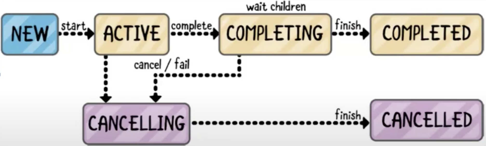

## Coroutines

Многопоточность в java есть, ее много, много надстроек, много примитивов синхронизации и тд.

IO bound приложения (торрент-клиент, сервис, делегирующий запросы, мессенджеры и тд.) располагают к хитрому параллелизму
В их работе часто возникает ситуация "кто-то кого-то ждет", а точнее ожидание-засыпание-снятие с процессора. В любом случае неприятно

Проблемы baseline подхода (один поток одна задача): 
* Не достаточно абстрактны
* их нельзя выделять слишком много. 
* wait-notify недостаточно абстрактны. 
 
Обычно используют пулы потоков. Но и у них есть проблемы: 
* вероятнее deadlock, усложнение обработки ошибок
* нарушение single responsibility

И вообще мы хотим абстракцию над потоками, которая
* правильно перераспределяла 
* улучшила процессорное время
* боролась с deadlock 

Корутины одна из таких штук. (тут он приводит много примеров таких штук)

Классическая корутина это механизм кооперативной многозадачности. Обычно кусок логики ожидающий чего-то. Пока ждет, другие могут работать
В основном рассчитаны на ассинхронный ввод/таймаута/ответ на запрос/другой корутин 

```kotlin
import kotlinx. coroutines.*

fun main () = runBlocking { // граница фреймворка, сущности с которой общается корутин. Говорит ему что пойдет спать
    println("start")
    launch {  // запуск первой корутины
        delay(1000L) 
        println("World!") 
    }
    println("Hello") 
}
```

Корутины во время сна не занимает поток. Поэтому 1000 корутин это не проблема, а 1000 потоков да.
 
```kotlin
fun main (): Unit = runBlocking {
    launch {
        println("start-1")
        delay(5000L)
        println("done-1")
    }

    Launch {
        println("start-2")
        delay(5000L)
        println("done-2")
    }
    println("parent")
}

// result:
// parent
// start-1
// start-2
// wait
// done-1
// done-2
```
`delay` передает управление корутинами фреймворку, дает возможность в том же потоке выполнить что-то другое. При этом вызов `launch` не блокирующий
Это засыпающая функция `(suspend)`

#### Suspend
* Засыпающие функции помечаются ключевым словом suspend
* Функция, вызываюшая suspend-функции, обязана быть suspend-функцией
* Вызов suspend-функции вне корутинного контекста запрещен
* launch возвращает объект класса Job

#### Job
* Над Job можно вызвать join - и дождаться завершения. Join - suspend 
* Можно вызвать cancel - в надежде прервать работу Job-a, это случиться как только Job войдет в suspend/засыпающий режим

Исключения: упал ребенок по исключению, отвалилось в родительском корутине. Как только выкинули исключение, даже если родительское корутино в delay
оно долетает. Почему так?

Концептуально корутина и порожденные ею корутины считаются частью единого решения. по умолчанию - если случается проблема в одном компоненте, это проблема всего решения

Схема состояний корутины


Позволяет создать побольше потоков. Так что проблемы с одновременным доступом к ресурсам сохраняется
```kotlin
fun main() = runBlocking(Dispatchers.Default) {
    (0..20).forEach { _ ->
        val job = launch {}
    }
}
```

`Launch` имеет параметры, например ленивый старт (только по команде)
```kotlin
fun main() = runBlocking(Dispatchers.Default) {
    val job = launch(start=CoroutineStart. LAZY) {
        delay (2000)
    }
    println(job)
    println(job.isActive)
    job.start()
    println(job)
    println(job.isActive)
}

/* result
LazyStandaloneCoroutine{New @d01e209
false
LazyStandaloneCoroutine{Active@d01e209
true
LazyStandaloneCoroutine{Completed}@d01e209
false true
*/
```

У корутин есть такая штука. И вообще там всякие параметры
```kotlin
coroutineContext.job.children // это мы сами, а от нас наши дети
```

`Cancel` где-то внутри прибьет нас самих и наших детей, но никого уровнем выше

### Свои suspend functions

Интерфейс `Continuation`
* Каждой корутине соответствует объект, реализующий его
* Через него можно "разбудить" корутину
* Можно получить этот объект


Пример корутины, которая обрабатывает события AsynchronousSocketChannel\
По сути клиентская часть
```kotlin
class CoroutineSocket() {
    val socket = AsynchronousSocketChannel.open()
    var isConnected: Boolean = false
        private set
    val isOpened: Boolean
        get() = socket.isOpen
    suspend fun connect(isa: InetSocketAddress) {
        suspendCoroutine {
            socket.connect(isa, it, ContinuationHandler(this))
        }
    }

    companion object {
        class ContinuationHandler<T>(private val socket: CoroutineSocket) : CompletionHandler<T, Continuation<T>> {
            override fun completed(result: T, attachment: Continuation<T>) {
                socket.isConnected = true
                attachment.resume(result)
            }

            override fun failed( exc: Throwable, attachment: Continuation<T>) {
                attachment.resumeWithException(exc)
            }
        }
    }
}
```

А это сервер на минималках, без callback опрашивает о состоянии, на пуле Dispetcher.IO. Зачем он здесь я не знаю
```kotlin
suspend fun bindAndAccept(port: Int): CoroutineSocket { // соединение с серверным сокетом? что простите?
    val result = suspendCoroutine {
        channel.bind(InetSocketAddress(port))
        val handler = ContinuationHandler<AsynchronousSocketChannel>()
        channel.accept(it, handler)
    }
    return CoroutineSocket(result)
}

suspend fun read(buffer: ByteBuffer): Int = suspendCoroutine {
    channel.read(buffer, it, ContinuationHandler<Int>())
}

suspend fun write(buffer: ByteBuffer): Int = suspendCoroutine {
    channel.write(buffer, it, ContinuationHandler())
}
```

Синтаксический сахар. Означает что мы сразу, до входа в main организуем контекст
```kotlin
suspend fun main () {} 
```

### Диспетчеризация и контексты
* Корутины кооперативны
* Suspention point - место, где корутина может уступить место другим. Место где мы ждем 
* Может возобновиться на другой нити, но на какой именно - решает контекст


Диспатчер на самом деле тоже одноэлементным контекст (реализует интерфейс контекста). 
Его достаточно, чтобы создать песочницу для корутин. Когда мы создаем в нем новую пользуемся сложением контекстов\
Каждый диспетчер управляет своим пулом потоков:
* Dispatchers.Main (1) работает на основном потоке. Для UI
* Dispatchers.IO (64+) использует пул потоков, предназначенный для операций, которые часто блокируются. Для сети и бд
* Dispatchers.Default (ядра) использует пул потоков, оптимизированный для вычислений. Для вычислений


* Каждая корутина запускается в некотором контексте
* Контекст представлен интерфейсом `CoroutineContext`. Зто своего рода словарь (map)
* У него есть операции: get(key), fold, plus, minusKey...

Проход по всем элементам контекста
```kotlin
fun main() { 
    runBlocking {
        coroutineContext.fold(Unit) { a, b ->
            println("key class" + b.key.javaClass)
            println("value class" + b[b.key]?.javaClass)
            println("key" + b.key)
            println("value" + b[b.key])
        }
    }
}
```

Самый базовый. Есть ключи
* Job.Key
  * значение BlockingCoroutine(Active}@77468bd9
  * Тоже самое coroutineContext.job
  * Описывает детали job
  * В первом приближении - job-часть определяется типом корутины
* ContinuationInterceptor.Key - по сути контекст от dispatcher.Default
  * значение BlockingEventLoop@4c77c2e
  * Способ диспетчеризации
  * Описывается тем, что было передано параметром в launch или аналог
  * По умолчанию - передается `CoroutineContext.EMPTY`, что означает наследование способа диспетчеризации

Как добавить ограничение параллелизма
```kotlin
runBlocking(Dispatcher.Default.limitedParrallelism(3)) {}
```

Обработка ошибок в детях. Всё что происходит в рамках этого контекста логически целое
* Можем сделать родителя супервизором
* Ему будут приходить извещения о проблемах детей
* Супервизор что-то с этим делает. Может игнорировать, может перезапускать

```kotlin
fun main() {
    runBlocking(Dispatchers.Default) {
        launch {
            val job = launch { //Supervisor Job)
                val scope = CoroutineScope(SupervisorJob())
                val handler = CoroutineExceptionHandler { ctx, exception ->
                    println("CoroutineExceptionHandler got Sexception")
                    println(ctx.job)
                }
                scope.launch(handler) {
                    printin("one")
                    delay(1000)
                    throw IOException() //  не ломает наружу
                }
            }
        }
    }
}
```

Launch
* suspend-функция сама по себе - не корутина. Часть, где храниться логика
* launch порождает Job/корутину 
* Внутри могут вызываться suspend-функции
* launch ничего не возвращает, но их значения можем использовать при вызове других


## Asynk/Deferr ed
* Defered<T> - развитие Job. Корутина, возвращающая значение
* У Defered есть suspend-метод await - ожидает результат
* async - аналог launch для конструирования Defered
```kotlin
fun main () = runBlocking { 
    val deferred: Deferred<Int> = async { // async - функция возвращающая Deferred
        loadData() // suspend function 
//      результат loadData() - это значение deferred
    }
    println("waiting...")
    println (deferred. await())
}
```
`async`, в отличие от suspend function, работает параллельно (suspend-функции выполняются по очереди)\
Пусть suspend-функция что-то скачивает, и мы хотим скачать что-то из двух мест и склеить
* Два вызова suspend-функции внутри корутины - два последовательных скачивания
* А две async-корутины - это два параллельных скачивания
```kotlin
fun main() {
    runBlocking(Dispatchers.Default) {
        launch {
            val actions = (0..10).map {
                async { // act = async
                    delay(random.nextLong(3000))
                    printin("after delayinnt it")
                }
//              act.await()  1) Print 0,1,2..  
            }
        } // 2) print 0,2,5,3,1..
        for (action in actions) { action.await }
    }
}
```
Есть `awaitAll` для списка Defered. 
* Но он привередлив в плане исключений
* Одно падение - падение всего сразу. Если это не устраивает - надо отдельно обрабатывать
* Вообще исключения выкидываемые в async ловятся в await(). Поэтому try или внутри async или вокруг await

### Flow
* flow - конструктор
* Возвращает реализацию интерфейса Flow - с suspend-методом collect
* Параметр билдера - блок, исполняющийся для извлечения элемента
* emit - suspend-метод. 
* Можно увидеть, что в примере emit и collect работают в одной корутине
* Flow - не корутина. Это реактивная структура
* Она умеет создавать Continuation над переданным блоком кода, и передавать управление на него из разных корутин


* Flow - Это контекст вычисления
* Его можно создать в обычной функции вне корутинного контекста
* И можно там же вызывать нетерминальные преобразования, а вот терминальное - это suspend-функция

```kotlin
fun main() { 
    runBlocking { 
        launch {
            val flow = randomData(10, 200)
            println("before collect") //1. в одной jobe с 2)
            flow.collect { println(it) } // забрали
        }
    }
}
fun randomData(count: Int, delayMs: Long) = flow { 
    // flow - функция которая возвращает реализацию интерфейс
    println("start flow") //2
    repeat(count) {
        delay(delayMs)
        emit(random.nextInt(100)) // положили 
    }
}

// emit1 -> collect1 -> emit2 -> collect2..
```
* Flow оттягивает момент создания объекта до начала итерирования
* И то, что возвращает flow-builder - это нечто, умеющее порождать итератор
* Реально итератор создается при вызове collect или одного из производных методов 
* В случае collect итератор работает, пока код, переданный в конструктор Flow, не завершится


**Нетерминальные**
* Стандартный набор: map, filter, flatMap, take, dropWhile и т.п. 
* Реактивно-специфичные: debounce
  * debounce получает параметром временной интервал 
  * Если между двумя emit-ами времени прошло меньше интервала, новое значение вытестняет старое
* Для sample
  * sample делит время на интервалы
  * Если в интевал попало больше одного, то в поток попадет последнее
* timeout - бросает исключение, если ничего не породилось в течение заданного таймаута 
  * (Если работа завершена - то для timeout это ok)

```kotlin
flow { emit(1) ; delay(90) ; emit(2) ; delay(90) ; emit(3)
       delay(1010) ; emit(4) ; delay(90) ; emit(5) ; delay(1010) ; emit(6)
}.debounce(1000).collect { ::println }
// 3 5 6 
```

* Накопительные fold/reduce: runningFold/runningReduce
  * Получаем поток промежуточных значений
  * Сделать накопительную свертку с количеством по ключевым словам, и над ней вызвать firstOrNull
```kotlin
fun main() { 
    runBlocking { 
        launch {
            val flow = randomData(20, 200)
            flow.withIndex().runningFold(Pair(0, -1)) { acc, curr -> 
                Pair(acc.first + curr.value, curr.index) 
            }.takeWhile { it.first < 200 }.collect(::println)
        } 
    } 
}
// (0, -1) ; Enter RandowData frlow ; (x, 0) ; (x + y, 1) ; (x + y + z, 2)..
```


**терминальные**
* Базовый: collect
* Производный: single - первый элемент с проверкой, что нет других
* Производный: first - первый, возможножно, что из многих
  * Возвращает то, что породил первый emit
  * Но следующий вызов first снова создаст новый итератор (похож на Java-stream с терминальными методами)
* singleOrNull, firstorNull
* toList, toset - могут зависнуть на бесконечном Flow
* launchIn - отдельный терминальный метод 
  * Принимает параметром контекст
  * В этом контексте запускает корутину, в теле корутины запускается collect
  *  launchIn возвращает Job


**on-style(callable)**
* мы потенциально преобразуем потенциальные значения. Добавляем действия которые потом будут исполняться.
* onEach - нетерминальный метод, описывающий действия над элементом
* onCompletion - действия по завершении. onStart, onEmpty - понятно (Снаружи внутрь)
* В on-методах можно делать emit


Один flow - много корутин
* Никаких проблем - можно из разных корутин вызывать методы одного экземпляра одного Flow 
* Когда дойдет до терминального - для каждой будет создан свой итератор и в каждом будет свое состояние
* А после терминального следующий терминальный породит новый итератор и новое состояние
```kotlin
fun main() { 
    runBlocking(Dispatchers.Default) { 
        launch {
            val flow = randomData(5, 200)
            repeat(100) {
                launch { printin(flow.toList) }
            }
        }
    }
}
//before delay: StandaloneCoroutine{Active}0236cc8a Job-1
//after delay: StandaloneCoroutine{Active}@3c3546e4 Job-0 
// ...
//after delay: StandaloneCoroutine(Active}@353a5964 Job-4
//[27, 29, 82, 28, 89]
```
* Может быть удобным запустить Flow в своей корутине
* Чтобы остановить итератор по cancel по таймауту
* Или по сложному критерию - который через цепочку нетерминальных сложно выразить


**RunWithTimeOut**
* Универсальный способ вызвать suspend - функцию с таймаутом - runWithTimeout
* Внутри себя создает корутину, в ней вызывает функцию
* По истечении таймаута вызывает cancel

```kotlin
fun main() {
    runBlocking(Dispatchers.Default) {
        launch {
            val flow = randomData(5, 200)
            repeat(100) { jobIndex ->
                withTimeoutOrNull(200) {
                    flow.collect { println("job #$jobIndex\n $it") }
                }
            }
        }
    }
}
```

Указанные подходы решают две проблемы 
* Изолировать итерирование по Flow в корутину
* Не уронить исключением весь контекст
Но есть еще одна: чтобы пользовательский код Flow смог услышать призыв остановить работу
* В типовых Flow такой проблемы не будет Но бывают специальные Flow - получающиеся из обычных коллекций
* На них могут работать вычислительные задачи и они не услышат cancel 
* Можно вызвать cancelable() над Flow и тогда проверка выполнится при заборе одного из значений


## Channel
* В первом приближении - аналог блокирующей очереди 
  * Нет класса Channel
  * Есть интерфейсы SendChannel<T> и ReceiveChannel<T>
  * Есть наследующий обоих интерфейс Channel<T>
  * И есть factory-метод Channel<T> создающий нужную реализацию
* Это структура данных с suspend-методами 
* Можно создать вне корутинного контекста 
* send/receive - suspend-методы
* По умолчанию capacity - 0, политика при переполнении - SUSPEND, режим - рандеву 
* Можно поставить capacity RENDEVOUZ, CONFLATED, BUFFERED или UNLIMITED 
* Политики при заполнении: SUSPEND, DROP_OLDEST, DROP_LATEST. Но не все комбинации осмысленны


1. RENDEVOUZ + SUSPEND - дождались получателя и передали. Курьер с доставкой не уходит пока не отдаст 
   1. CONFLATED - про переиспользование. Важно отдать свежее. Если буфер переполняется старое не храним пишем новое
2. CONFLATED + SUSPEND - работает. С буфером размера 1. Ящик размера один всегда со свежим 
3. UNLIMITED игнорирует второй параметр. Считает что переполнения не существует 
4. BUFFERED + SUSPEND - буфер стандартного размера 
   1. По умолчанию 64, конфигурируется через проперти 
   2. BUFFERED + DROP_OLDEST/DROP_LATEST - эквивалент CONFLATED (+ SUSPEND)
5. число + любой

```kotlin
import java.nio.BufferOverflowException

val channel = Channel<Int>(/* BufferCapacity.BUFFERED, BufferOverflow.DROP_LATEST */)
fun main() = runBlocking(Dispatchers.Default) {
  launch {
      for (x in 1..5) {
          println("before send")
          channel.send(x * x)
          println("after send")
      }
  }
  repeat(5) {
      delay(1000)
      println(channel.receive())
  }
}
```

Закрытие канала
* Канал можно закрыть
* На читающей стороне это приведет к завершению итератора
* В блокирующих очередях подобное можно делать, но только через отдельные приседания в пользовательском коде
* close породит исключение на читающей стороне
* Типовая логика итерирования его обработает и примет как руководство к завершению итерирования
* Есть еще cancel со своим исключением. Его `for` не обрабатывает
```kotlin
fun main() = runBlocking {
    val channel = Channel<Int>()
    launch {
        for (x in 1..5) channel.send(x * x)
        channel.close()
    }
    for (y in channel) println(y)
}
```


```kotlin
fun CoroutineScope.produceSquares(): ReceiveChannel<Int> = produce {
//    Вне корутинного контекста, но в CoroutineScope. мы задаем его логику как будто в корутине
//    Помещаем внутрь контекста, передаем лямбде контекст как this
    println(coroutineContext.job)
    for (x in 1..5) send(x * x)
}

fun main() = runBlocking(Dispatchers.Default) {
    println(coroutineContext.job)
    val squares = produceSquares()
    squares.consumeEach { println(it) }
}
```
Flow - приклеиваеться к корутине, а channel в producer-корутина порождает данные из себя
И здесь рандеву - идеальная конфигурация канала\
Но может быть так, что данные мы берем откуда-то еще: из внешнего мира или от другого producerа\
Например ситуации с большой сложной обработкой файлов


Сложная ситуация если в нас пушат данные из надо положить в channel и обработать
* Не факт, что всегда можем спокойно ждать, пока consumer прочитает
* Противоположная крайность - бесконечная очередь, можем буферизовать, но память конечна
* Промежуточный вариант - буфер конечного размера
  * В канале можно сохранить данные, порожденные от вспышек активности
  * В идеале, размер буфера должен быть расчитан на них
  * Но не должно быть принципиально дизбаланса скоростей записи и чтения
* Можем включить режим перезаписи старого 
* А если при заполнении ждем освобождения - это механизм backpressure. Но для этого тот кто дает должен уметь тормозить


Зла
1. задержки в обработке (глобальные) 
2. out of memory
3. потери данных/дупликация данных
4. Возможны комбинации


### Проблемы параллелизма в корутинной модели
LiveLock, DeadLock, Starvation

LiveLock. Нет факта lock что-то идет, но в бесполезном состоянии
```kotlin
val p1: CoroutineScope.() -> ReceiveChannel<Int> = 
  fun CoroutineScope.(): ReceiveChannel<Int> = 
      produce {
          println(coroutineContext.job)
          val c2 = p2()
          c2.consumeEach { send(it) }
      }

val p2: CoroutineScope.() -> ReceiveChannel<Int> = 
  fun CoroutineScope.(): ReceiveChannel<Int> = 
      produce {
          println(coroutineContext.job)
          val c1 = p1()
          c1.consumeEach { send(it) }
      }
fun main() = runBlocking {
  p1().consumeEach { println("v: " + it) } 
}
// p1 - создает кого-то, кто ждет p2, а p2 - создает ожидальшека p1. Не стоим, но и существенной деятельностей нет
```

### Акторы
* Внеязыковая абстракция. Философия дизайна
* Легкий объект с состоянием и поведением, который может получать сообщения
* Поведение - только как реакция на сообщения
* Можем изменить состояние, ответить отправителю, послать сообщения кому-то другому 
* Все асинхронно, даже ответ отправителю


timeline актор
* ООП скомбинированное с параллельностью. Есть объект
* У каждого актора своя ось времени, на оси строго упорядочены отрезки обработки сообщений
* Ненулевые, но и не большие
* Не должны произвольно растягиваться Разве что в рамках trade-of
* На каждой такой оси воспроизводится схема с одним активным в моменте объектом
* Но на разных временных осях может активизироваться один и тот же объект


* Актор можно считать объектом. С полиморфизмом и наследованием - зависит от реализации (котлин скорее нет и не надо)
* Инкапсуляция - близка к идеалу (в котлине близко к идеалу. Через локальные переменные)
* Вместо методов - сообщения, а сложность - только с гарантией доставки ответа


Плюсы
* Акторная модель "правильнее" использует многопоточность 
* Акторы-объекты реально параллельны и у них не двоится сознание
* Можно проектировать систему как набор акторов с состоянием и правилами коммуникации


Краулинг - пример. Ходим по сайтам сохраняем запросы и тд и тп
* Какие-то акторы непосредственно общаются с http-клиентом
* анализируют содержимое, сохраняют полезную информацию, отслеживают очередь, обрабатывают сбои и отказы

Пример сервис-агрегатор
* Сервис-агрегатор ежедневно зачитывает данные от партнеров
* От каждого партнера - в своем формате, в любом случае - виртуальная лента из коротких объектов
* Заведем по актору на каждую ленту, и на разные преобразования - унификация формата, обогащение, агрегация 
Получили интуитивное эффективное распараллеливание


Гарантии доставки
* Exactly once - ценой блокировок или усложненных алгоритмов
* At most once - бесплатно
* At least once - нужны усилия, но сильно проще, чем exactly once
* В широком классе ситуаций - де-факто exactly once

```kotlin
fun main() = runBlocking(Dispatchers.Default) {
    val actor = actor<String>() { // какой тип данных принимаем и как обрабатываем 
                                  // actor - возвращает писательскую часть актора
        for (data in channel) println(data) // channel - что-то с read и write
          // suspend внутри for это очень плохо. Мы усыпим канал и его надо как-то снаружи будить
          // corutinScope.actor может быть suspend (по умолчанию) или unlimited
    }
    actor.send("1234")
    actor.send("2345")
    actor.send("3456")
    actor.close()
}
```
* Надо в протоколе предусмотреть возможность передать SendChannel 
* Отправитель передает себя (channel) 
* Получатель туда отправляет сообщения (можно сложнее)

Минусы/Могло быть лучше
* Идентификация актора сводится к Java-объекту
* Актор может упасть. В духе реактивного подхода он должен рестартовать
* Это можно сделать через супервизор, но это будет другой актор с другой идентичностью

Ленивые блокировки
* Канонический актор не должен делать блокирующих действий
* suspend-методы являются лечением многих проблем блокировок, но в акторах не надо
* Можно только если знаем, что делаем
