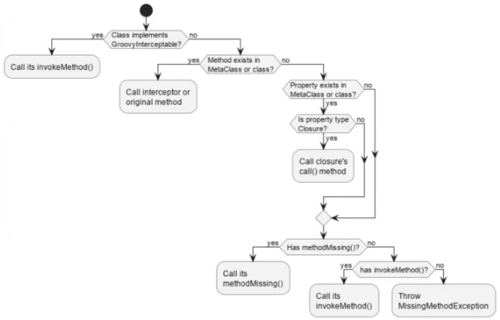

## Groovy

* Более динамический, чем Kotlin. И эта динамика не много въехала в jvm
* Но при этом компилируемый, это не интерпретатор, написанный на Java 
* Есть свой синтаксис
* Поддерживает многое из Java как подмножество. Вероятность скормить в groovy куски java


Совпадает с Java/Kotlin
* if/else, while, for, break, continue
* Общее понятие классов и объектов, основная структура типов
* Общее понятие полей и методов Статика - близко к Java


* Типо динамически-скриптовое, но как будто java
* Одноаргументные вызовы можно делать без скобок
* Код может быть вне функций
* Простые программы можно писать в скриптовом стиле
* Через static main - тоже можно

```groovy
static def f(v) { return v + 1} // динамическая типизация
static def f(int v1, v2) { return v1 + v2 }
def nArgs() { return args.length }
println "Hello world!"
println this.args
println(f 10)
println(f(2, 3)) 6 println(nArgs())
```

Структура
* Пакеты и классы как в java
* В конечном итоге все оборачивается в классы
* Можно несколько классов в исходнике
* Код глобального уровня попадает в класс, одноименный с файлом и явного класса с таким именем быть не должно
* def глобального уровня превращается в методы неявного класса
* А исполняемые куски кода (println в примере) - оборачивается в метод run без аргументов
* Если попытаться определить метод run - будет конфликт с неявным
* Все семантические ошибки будут пойманы во время исполнения

```groovy
def methodMissing(String name, args) { // ловит вещи которые не смогли вывести типы, не свелись куда-то
    if (name == "f") {
        return f(Integer.parseInt(args[0]), args[1]).toString()
    }
}
```

### метапрограммирование
* Как в JVM реализовать duck typing? это когда мы явно не пишем, а например угадываем типы
* Или динамический полифорфизм? Чтобы мы правильно исполнили `a + 5`
* Пришла ли нам в `а` строка, число или что-то еще?

Смотря в какой версии JVM. До JDK-7 было 4 JVM-инструкции для вызова
* invokestatic - для статических методов
* invokespecial - для конструкторов, и приватных
* invokeinterface - для вызовов через интерфейс
* invokevirtual - для обычных методов. Ближе всего к тому, что надо.

`invokevirtual`
* Байткод символьно ссылается на `Q.m`
* Загрузка класса Q3 предполагает загрузку класса Q
* И проверку того, что там есть метод m. И если его нет - это проблема

В Groovy
* И вот мы пишем: `def f(v) { v.m() }`
* def должен превратиться в какой-то JVM-метод
* И у него должен быть тип параметра. Видимо это должен быть Object, но тогда у Object должен быть метод m

Поэтому. B JDK7 введен новый механизм вызова `invokedynamic` и сопутствующее АРІ в java.lang.invoke
`invokedynamic`
* Ускоряем поиск нужного метода и его вызов
* Вводит ряд новых абстракций. Часть из них полезна и в рамках Java
* invokedynamic указывает на bootstrap-метод. Его задача - найти и вернуть CallSite
* Ему передается MethodHadle.Lookup, имя метода и сигнатура
* Возможно, зафиксировать изменяемый CallSite для будущего изменения
* Это универсальный механизм, не только для Groovy
* В Groovy CallSite будет дополнительной прослойкой
* Она должна по классу объекта понять, что делать дальше и вызвать какой-то MethodHan

```java
class C {
    public static Object m() {
        System.out.println("hello from m");
        return "";
    }
}
public class Main {
    public static void main(String[] args) throws Throwable {
        MethodHandles.Lookup mhl = MethodHandles.lookup();
//        видит так как Main.main()
        var t = MethodType.methodType(Object.class);
        var mh = mhl.findStatic(C.class, "m", t);
        System.out.println("mh: " + mh);
        mh.invoke();
        var t2 = MethodType.methodType(String.class);
        var mh2 = mhl.findVirtual(String.class, "trim", t2);
    }
}
```

MethodHandler
* Абстракция, объединяющая в себя методы и все похожее. А еще хранит контекст создания
* Через него можно не видить private, а можем наоборот перекидыывать чтобы увидеть
* Ее можно хранить, передавать и вызывать
* MethodHandles.Lookup - factory для MethodHandler
* Создается через factory

Callsite
* Контайнер для экземпляра MethodHandler
* Каждый исполнившийся экземпляр invokedynamic связан с экземпляром CallSite
* Связь устанавливается при первом исполнении и остается, пока JVM работает
* CallSite - абстрактный класс. Есть три реализации: ConstantCallSite, MutableCallSite, VolatileCallSite
  * ConstantCallSite намертво привязывает MethodHandle
  * MutableCallSite/VolatileCallSite позволяет менять MethodHandle
  * Но надо хранить знание о местоположении invokedynamic


Мотивация. 
* XML, JSON 
  * Хочется каждый узел воспринимать как объект с атрибутами
  * И сюда duck typing тоже 
  * И не всегда мы уверены, что в одном поле значения одного типа
* Http-заголовки
  * Переменный набор атрибутов
  * Сложная типизация полей
  * Интерпретация тела в зависимости от размера и от Content-type
* Отладка 
  * Через метапрограммирование легко отслеживать вызовы методов
  * Считать, профилировать, делать прокси и моки
  * Даже то, что в Java делается аннотациями - в Groovy проще
* AST
  * Аннотации в Groovy тоже есть, но с другим смыслом
  * Они позволяют делать преобразования во время компиляции, в том числе - порождать байткод

```groovy
class Interception implements GroovyInterceptable {
    def definedMethod() {}

    def invokeMethod(String name, Object args) {
        System.out.println("name: " + name)
        System.out.println("args: " + args)
    }
}
class C {
    static def void main(String[] args) {
        new Interception().m()
        new Interception().definedMethod()
    }
}
```

Вызов своего метода
* Самый радикальный - реализовать интерфейс GroovyInterceptable
* У объектов такого класса будут "замаскированы" все методы. Даже println нельзя будет вызвать
* Можно добраться до метакласса, вызвать getMetaMethod и вызвать invoke (более Groovy-style)
* Можно найти метод через Java-рефлексию


Механизм перехвата



Вообще в Groovy три вида объектов
* POJO - JVM-объект вне Groovy (написан на Java, Kotlin)
* POGO - Groovy-объект вне Groovy (написан на Groovy, реализует groovy.lang.GroovyObject)
* GroovyInterceptor - реализует groovy.lang.GroovyInterceptable
  * groovy.lang.GroovyInterceptable - маркерный интерфейс, наследник GroovyObject


```groovy
class POGO {
    private
    String field
    String property1

    void setProperty1(String property1) {
        this.property1 = "setProperty1"
    }
}
def pogo = new POGO()
pogo.metaClass.setAttribute(pogo, "field", "ha") 
pogo.metaClass.setAttribute(pogo, "property1", "ho")
```


Расширение чужого
* Можно написать вручную классы со статическими методами
  * С первыми параметром типа расширяемого класса и задействовать JVM-механизм ServiceLoader
* Можно воспользоваться уже готовыми расширениями
  * И есть механизм локазизации их действия. По сути - обертка над метапрограммным механизмом Groovy
  * Расширения действуют в пределах блока кода
* DelegatingMetaClass - делегирует "настоящим" методам
  * Его invokeMethod можно перекрыть и выполнять нужную логику до и после вызова

```groovy
class C {
    static def void main(String[] args) {
        String invoking = 'ha'
        invoking.metaClass.invokeMethod = { String name, Object argv ->
            if (name == "length") {
                return delegate.class.metaClass.getMetaMethod(name, args)?.invoke(delegate, args)
            }
            'invoked'
        }
        System.out.println(invoking.length())
        System.out.println(invoking.replace('a', 'b'))
        System.out.println("qwerty".length())
        System.out.println("qwerty".replace('e', 'i'))
    }
}
```

```groovy
class Book {
    String title
}
Book.metaClass.titleInUpperCase << { ->
    title.toUpperCase()
}
def b = new Book(title:"The Stand")
assert "THE STAND" == b.titleInUpperCase()
```

Trate - тоже про довесок в начале/конце к методу, когда не хотим смешивать логику\
Trait в Groovy — это механизм, позволяющий реализовать многократное наследование поведения 
(по аналогии с интерфейсами с реализацией в Java). Traits предоставляют возможность:
* Определять свойства и методы.
* Подключать поведение к классам через implements.
* Добавлять функциональность в классы

```groovy
trait Greetable {
    String greet(String name) {
        "Hello, $name!"  // Реализация метода
    }
}

trait Counter {
    int count = 0  // Поле в Trait

    void increment() {
        count = count + 1
    }

    void reset() {
        count = 0
    }
}


// Класс реализует два Traits
class Person implements Greetable, Counter {
    String name
}

def person = new Person(name: 'Alice')
println(person.greet(person.name))         // Вывод: Hello, Alice!
counter.increment()
println(counter.count)  // Вывод: 1
counter.reset()
println(counter.count)  // Вывод: 0
```

