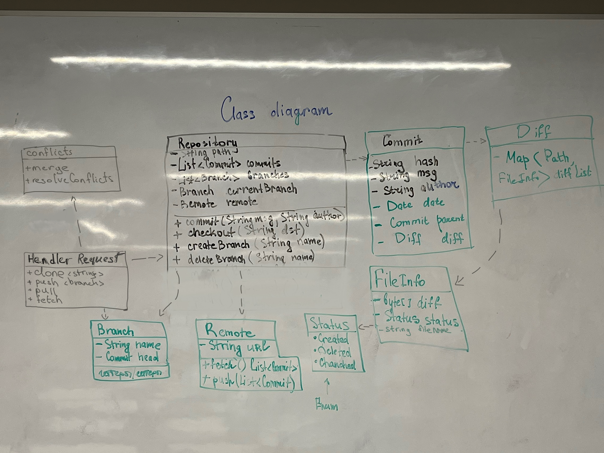
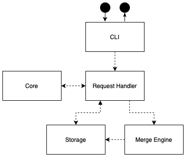

# Пояснения
Работа выполнена в классе. Здесь предложены ответы на вопросы, пояснения отсавщиеся с практики

1. Как представляются файлы, коммиты, ветки, репозиторий?
2. Как выполняется компрессия и выполняется ли вообще? Насколько просто получить текущую, предыдущую, произвольную версии?
3. Каков жизненный цикл файла?
4. Как выполняется работа с файловой системой?
5. Как выполняется работа с пользователем? Как представляются команды?
6. Как выполняется работа с сервером со стороны клиента?
7. Какова архитектура серверной части?

### Классы
* FileInfo – информация о файле.
    * byte[] dif хранит в себе изменения между текущей и предыдущей версией файла
    * Status status отображает, какое действие было произведено с файлом: удаление, создание в директории, изменение, добавление в локальный репозиторий, изменения закоммичены
    * String fileName – полное имя файла из корня репозитория
* Commit – информация о коммите.
    * String hash – уникальный хэш для каждого коммита
    * String msg и Strign author – commit message и автор коммита
    * Date date – дата, в которую коммит был совершен
    * Commit parent – ссылка на предыдущий коммит
    * Diff diff – изменения, сделанные между текущим коммитом и его родителем
* Branch – информация о ветке.
    * String name – имя ветки
    * Commit HEAD – указатель на текущий коммит
    * Bool isRemote – флаг, указывающий является ли ветка локальной или удаленной
* Repository – информация про репозиторий.
    * String path – путь, которому находится репозиторий в локальной файловой системе
    * List<Commit> commits – список всех коммитов в репозитории
    * List<Branch> branches – список всех веток
    * Branch currentBranch – указатель на текущую ветку
    * Remote remote – удаленный репозиторий, с которым связан локальный

### Snapshots
Полные снимки (snapshots) сохраняются каждые 10 версий (например, версии 10, 20, 30…). Это полные копии файлов на момент этих коммитов. Между снимками хранятся только изменения (diffs) между каждыми двумя коммитами.
Полные версии сжимаются по отдельности с помощью метода zlib, разницы между версиями (diffs) сжимаются по отдельности с помощью метода LZ4.

### Файлы
У файла есть несколько этапов жизни:
1. Создание в директории: когда файл только создан, то у FileInfo, который ему соответствует, в поле Status лежит значение created, но он никак не отслеживается репозиторием.
2. Изменение: при изменении файла из репозитория у FileInfo, который ему соответствует, в поле Status лежит значение changed.
3. Удаление: при изменении файла у FileInfo, который ему соответствует, в поле Status лежит значение deleted.
4. обавление изменений в локальный репозиторий: у FileInfo, который соответствует файлу, в поле Status лежит значение tracted. Все изменения файлов, помеченных tracked, попадут в будущий коммит.
5. Изменения закоммичены: у FileInfo, который соответствует файлу, в поле Status лежит значение commited, что означает, что изменения, которые произошли в каком-то файле были закоммичены

Разделение состояний файла на изменения добавлены в локальный репозиторий и изменения закомиченны позволяет коммитить только часть каких-то изменений, которые были сделаны. Иначе бы у пользователя не было бы выбора, какие изменения он хочет закоммитить, а какие нет. Все изменения автоматически попадали бы в коммит.

### Файловая система
Работа с файловой системой следующая:
* Для текущей версии файлов данные берутся непосредственно из рабочей директории.
* Для исторических версий: восстанавливается последний snapshot, затем на него последовательно накладываются соответствующие diff'ы. Это позволяет эффективно получать любую версию без необходимости хранить все полные копии всех версий.

### Пользователь
CLI – консольное приложение, с которым взаимодействует пользователь.
* Занимается парсингом команд
* Разделяет команды на те, что управляют локальным и удаленным репозиториями
* Для команд commit, checkout, log, add вызывает соответствующие методы класса Repository
* Для команды merge вызывает соответствующий метод Conflicts
* Для команды clone, fetch, push, pull вызывает соответствующий метод  Request Handler

### Сервер
Для взаимодействия с сервером (удаленным репозиторием) пользователь через CLI может только использовать команды pull, fetch, push, clone.
Через CLI пользователь вводит нужную команду, Request Handler обращается к Storage, чтобы выполнить необходимую команду.
Серверная часть  реализована как модуль Storage (удалённый репозиторий), который взаимодействует с RequestHandler.

Функционал Storage (удалённый репозиторий):
* Хранение данных:
    * Snapshots — полные снимки файловой системы проекта на определенных контрольных точках (каждые 10 коммитов). Сжимаются с использованием алгоритма zlib.
    * Diffs — изменения между последовательными коммитами. Сжимаются через алгоритм LZ4.
* Обработка команд:
    * clone – отдаёт последний snapshot + все diffs до него
    * fetch – возвращает новые коммиты без применения
    * pull – отправляет новые коммиты и применяет их в локальном Core
    * push – принимает коммиты от клиента, проверяет конфликты (через Merge)
* Взаимодействие:
    * RequestHandler передаёт запросы от CLI в Storage.
    * При конфликтах Storage использует Merge для их разрешения.

[Ссылка на диаграмму компонентов](https://drive.google.com/file/d/1RzSmaC3pIMwr7846PMhhdtrfc82auO58/view?usp=sharing)

