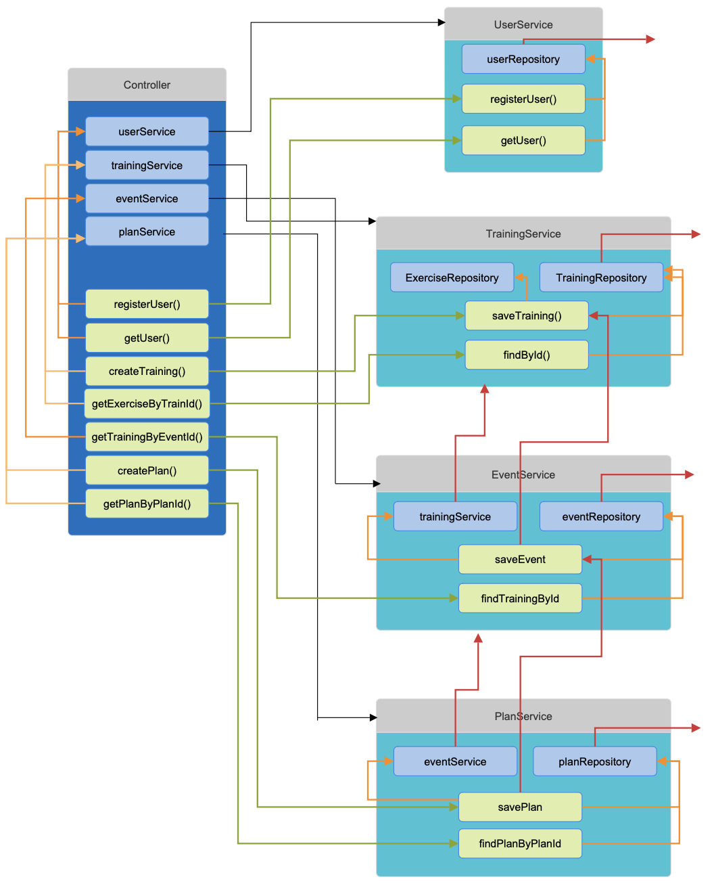

## HW-2
### Option 1: LC/HC Task
1. Построить граф зависимостей (обфускация если NDA)
2. На основе графа описать выводы о том 
   * У кого все ок 
   * Кто сильно зацеплен (подумать, написать почему и решить ок ли это)
   * Кто слабо связан (подумать, написать почему и решить ок ли это)

### Solution
В папке `resources` приведен фрагмент сервера для приложения, которое хранит
тренировочные планы, занятия и пользователей ([проект hse 2курс](https://github.com/Arishkamu/sport-app-project))

### Описание
Отдельными компонентами будем считать классы, а методы и поля в них внутренними компонентами

Оценим степень зацепленности каждого класса, на глаз и с помощью LCOM
* Controller: LCOM = 18 - 3 = 15. Это большой показатель, он легко объясним, 
   поскольку методы контроллера соответствуют http запросам. Однако, это значит,
   что оптимальным решением было бы разбить контроллер на несколько, в соответствии с сервисами.
   В таком случае, LCOM по всем контроллерам вместе = 0 (отрицательный)
* UserService: LCOM = 0. Тут все хорошо, сильное зацепление, добиться этого не сложно когда методов и полей мало
* TrainingService, EventService, PlanService: LCOM = 0. Все тоже самое что и для UserService

Оценим связность. Отдельно оценим стабильность. Абстрактность оценивать сложновато, поскольку
код написан с использованием Spring, и явно прописанных абстракций нет 
* Controller: I = 1. Зависит от всех, но никто от него не зависит. Это нормально в данном случае,
   контроллер примерно для этого и предназначен, он перераспределяет задачи на более мелкие сервисы. 
   Таким образом мы разделяем сферы влияния. Однако, помним, что при разбиении его на несколько отдельных
   контроллеров, результат был бы тем же, но проблем меньше
* UserService: I = 1/4 здесь не прописано, но мы зависим от Repository (верно для всех). 
* TrainingService: I = 2/7 
* EventService: I = 3/7. Близко к половинке, нормальный результат 
* PlanService: I = 1/2
Проблемы Training, Event, PlanService которые видно "на глаз" это зависимость сервисов друг от друга
Показатель стабильности средненький (буквально)), общее число связей не большое, что радует, но если мы говорим
о конкретном продукте, то связь сервисов между собой это не очень хорошо. В тоже время так было реализованно с учетом 
логики приложения. (Если мы не можем сохранить тренировку, то и план тоже) и опять же, 
задачи распределены между сервисами, то есть PlanService не занимается сохранением тренировок как таковой, он
перепоручает эту задачу TrainingService

### Итог
* У controller проблемы с зацеплением, и их легко решить. Не качественная реализация. Связность полностью оправдана 
   архитектурой
* У userService всё хорошо
* у TrainingService, EventService, PlanService хорошее зацепление, но не очень хорошая связность. 
   у TrainingService чуть лучше, но от него зависят остальные. По большей части это обусловлено логикой продукта,
   но если бы получилось придумать решение и с учетом логики и с меньшей связностью. (к примеру здесь можно было бы
   обойтись без Event совсем) было бы лучше