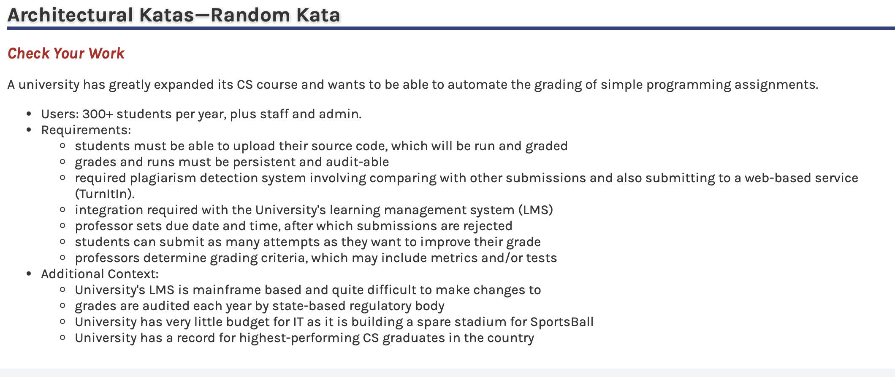
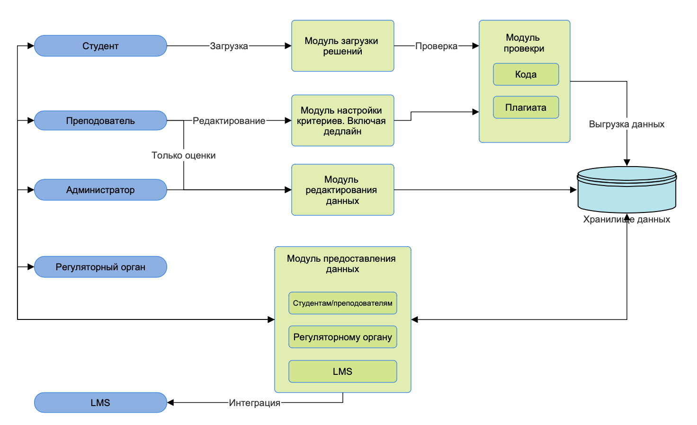
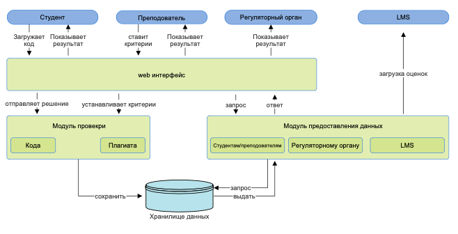
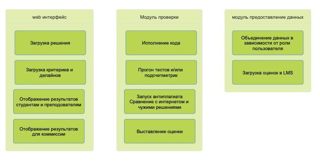

## HW-3
Выберите случайную архитектурную кату и решите ее
1. Проработайте бизнес-возможности (выделите акторов, сущности и действия)
2. отрисуйте их взаимосвязи и сгруппируйте 
3. в произвольном формате, например C4 Component, отрисуйте компоненты вашей системы 
4. опишите точки роста системы (где как вам кажется могут возникнуть проблемы и как их возможно решить)
5. (опционально) опишите технологический стек и мотивируйте его выбор

### Solution

Выбранная карта

**Акторы**
* Студенты (300+) в год. Одновременно в университете порядка ~1200 
* Преподаватели, практиканты
* Администраторы со стороны университета, техническая команда от LMS
* LMS как система
* Система проверки плагиата
* Регуляторный орган

**Сущности**
* Загружаемые код
* Результаты прогона/запуска кода
* Оценки по результатам запуска программ и критериев
* Тесты и/или метрики для проверки
* Результаты проверки плагиата
* Опционально: формулировки заданий 

**Действия**
* Вход в систему
* Добавление нового задания преподавателем. Включая критерии проверки
* Установка дедлайна по заданию
* Редактирование задания (критериев) и дедлайна
* Загрузка решения студентом
* Запуск программы. Запуск тестов и/или подсчет метрик. Включая проверку на плагиат
* Сохранение результатов, подсчет оценки
* Просмотр результатов студентом и преподавателем. Возможно показ ошибок или какого-то комментария по работе
* Выгрузка данных об оценках в LMS
* Редактирование и/или подтверждение оценок преподавателем
* Просмотр заданий, попыток сдачи, оценок регуляторным органом

#### Взаимосвязи

#### Контекст

#### Компоненты

#### Точки роста
Проблемы и решения
1. Любые проблемы при взаимодействии с LMS. Устаревшая система, которая сложно редактируется
   * Решение: Минимизировать взаимодействие. Разработка отдельного API, которое только предоставляет оценки
2. Необходимость долго хранить данные (как минимум год для комиссии)
    * Решение: Создать отдельное хранилище (сервер или облачное) для комиссии, возможно с более долгим доступом тк информация
   оттуда нужна редко. Результаты каждого задания выгружать туда после дедлайна и удалять из основной базы данных, доступ к которой нужен часто и быстро
3. Финансирование. Упомянуто в дополнительных пунктах
    * Решение: Как разработчики мы не можем увеличить бюджет университета, я могу предложить только создать систему максимально простой и надежной
4. Направление одно из самых квалифицированных поэтому возможно увеличение числа студентов. Проблема масштабируемости
    * Решение: Добавление серверов/машин для прогона кода. Формально упираемся в проблему финансирования, но раз направление популярное, можно и денег больше запросить 

